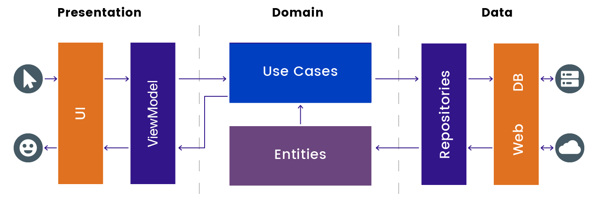

# Dog Breeds App

Requirements
----
Welcome to the Dog Breeds App!

This app allows users to view a list of dog breeds, get detailed information about each breed, and add/remove breeds to/from their favourites. The app features two tabs, Home and Favourites, making it easy for users to switch between the two lists as shown in the attached screenshots.

The app fetches dog breed data from [TheDogAPI](https://thedogapi.com/), and for offline use, the data is persisted within the app’s local database, ensuring that users can still access their favourite breeds even when they’re offline.

## Tech Stack 🛠️
## Architecture
The app follows a Clean Architecture pattern with MVVM (Model-View-ViewModel) architecture. This approach keeps the codebase modular and maintainable by segregating responsibilities into different layers.
Layers:

* UI Layer (Presentation Layer) - Displays the app’s data to the user.

* Domain Layer - Encapsulates the business logic and Use Cases.

* Data Layer - Handles data fetching and storage, whether from a remote source (API) or local database.

### Core Components
Koin for dependency injection
Paging 3 for efficient data loading
Room for local persistence
Retrofit for network operations
Jetpack Compose for UI

## :package:  Project Dependencies
I have used the dependencies which are part of [Jetpack](https://developer.android.com/jetpack) and also some third-party libraries. The project dependencies which are used in this project are as follows:

### Jetpack libraries
- [Compose](https://developer.android.com/jetpack/androidx/releases/compose) - Defines UI programmatically with composable functions that describe its shape and data dependencies.
- [Compose Foundation](https://developer.android.com/jetpack/androidx/releases/compose-foundation) - Write Jetpack Compose applications with ready-to-use building blocks and extend the foundation to build your design system pieces.
- [Compose UI](https://developer.android.com/jetpack/androidx/releases/compose-ui) - Fundamental components of compose UI needed to interact with the device, including layout, drawing, and input.
- [Compose Material](https://developer.android.com/jetpack/androidx/releases/compose-material) - Build Jetpack Compose UIs with ready-to-use Material Design Components.
- [Arch Core](https://developer.android.com/jetpack/androidx/releases/arch-core) - Helper for other arch dependencies, including JUnit test rules.
- [Room](https://developer.android.com/training/data-storage/room) - Create, store, and manage persistent data backed by an SQLite database.
- [KOIN Dependency](https://insert-koin.io/) - Dependency injection plays a central role in the architectural pattern used.
- [Navigation](https://developer.android.com/jetpack/androidx/releases/navigation) - Build and structure your in-app UI, handle deep links, and navigate between screens.
- [Paging for Compose](https://developer.android.com/jetpack/androidx/releases/paging): For paging large lists in Jetpack Compose.

### Other libraries
- [Kotlinx Coroutines](https://github.com/Kotlin/kotlinx.coroutines) - Library Support for coroutines. I used this for asynchronous programming to obtain data from the network.
- [Retrofit](https://square.github.io/retrofit/) - Type-safe HTTP client and supports coroutines out of the box.
- [GSON](https://developer.android.com/jetpack/androidx/releases/paging) - JSON Parser, used to parse requests on the data layer for Entities and understands Kotlin non-nullable and default parameters.
- [okhttp-logging-interceptor](https://github.com/square/okhttp/blob/master/okhttp-logging-interceptor/README.md) - Logs HTTP request and response data.
- [JUnit](https://junit.org/junit4/) - This was used for unit testing the database, the use cases, and the ViewModels.
- [Mockk](https://mockk.io/) This is a mocking library for Kotlin. I used it to provide test doubles during testing.
- [Truth](https://truth.dev/) - Assertions Library, provides readability as far as assertions are concerned.
- [Espresso](https://developer.android.com/training/testing/espresso) - Used for writing Android UI tests for our DAO.
- [Coil](https://github.com/coil-kt/coil) - Image loading for Android backed by Kotlin Coroutines.
- [Accompanist Pager](https://google.github.io/accompanist/pager/) - A library that provides paging layouts for Jetpack Compose.
- [Accompanist Navigation Animation](https://google.github.io/accompanist/navigation-animation/) A library that provides Compose Animation support for Jetpack Navigation Compose.
- [Kotest Assertions](https://kotest.io/docs/assertions/assertions.html) -  I am using it in the test cases. Kotest calls types of state assertion functions matchers.

## :rocket: Getting Started 🚀
- Clone the repository:
    `https://github.com/jemooh/DogBreedsApp.git`

- Build and run:
     *  Open the project in Android Studio.
     *  Click Run or use the command below:
        `./gradlew build`

### Dog Breeds app screenshots

| 
|| 
|| 

### Thank you! :raised_hands: